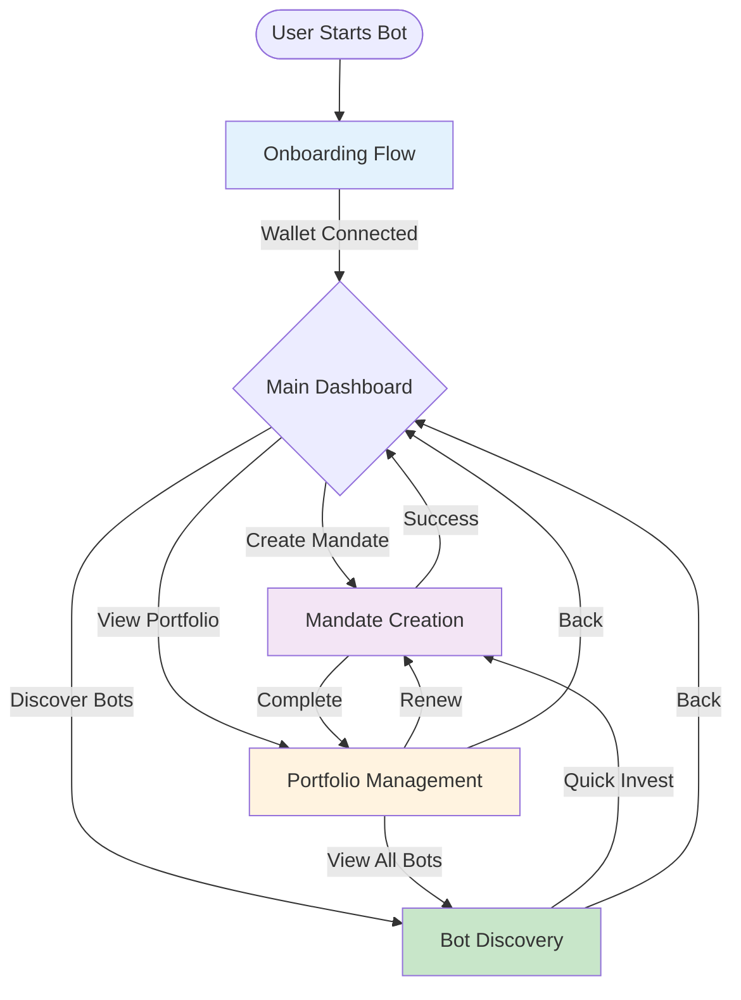
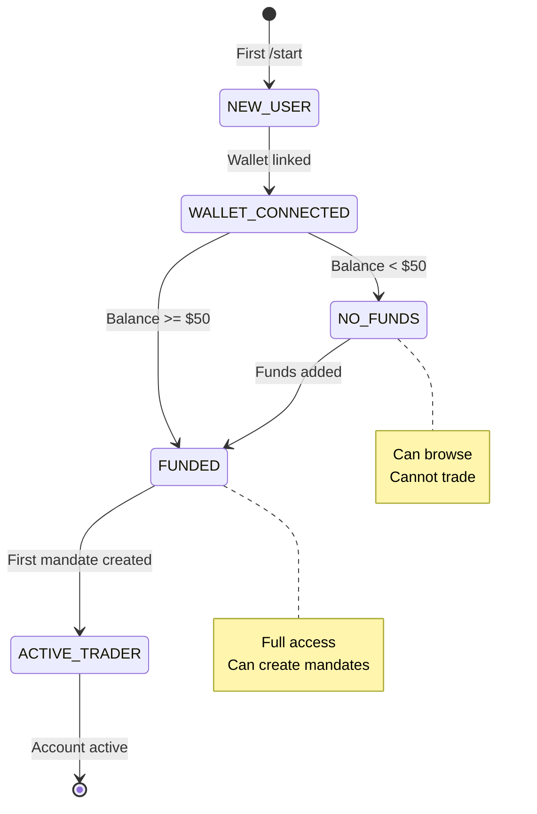

# Agent x402 - Flow Documentation

**Document ID**: PA001
**Created By**: performance-analyzer
**Created At**: 2025-10-03T08:13:16.320Z
**Project Root**: /Users/groot/Documents/code/telegram-402

---

# Agent x402 - Flow Documentation

## Overview

This directory contains comprehensive flow documentation for Agent x402, a Telegram-based AI trading bot. Each flow is documented with detailed Mermaid diagrams, interaction patterns, message templates, and implementation guidelines.

---

## Core Flows

### 1. [Onboarding Flow](./flow-onboarding.md)
**Entry**: `/start` command or first interaction

User journey from first contact to active trading account:
- Wallet connection (MetaMask, WalletConnect, Manual)
- Balance checking
- User state management
- Phase 1 implementation (direct wallet custody)

**Key Features**:
- ✅ Simple 3-step onboarding
- ✅ Multiple wallet options
- ✅ Real-time balance verification
- ✅ Error handling and recovery

---

### 2. [Mandate Creation Flow](./flow-mandate-creation.md)
**Entry**: `/create`, `/mandate` commands or "Create Mandate" button

Complete 5-step process for setting up autonomous trading:
- Amount selection (with validation)
- Strategy selection (DCA, Grid, Arbitrage)
- Risk configuration (Conservative, Moderate, Aggressive)
- Duration setting (24h - 90d)
- Review, signature, and activation

**Key Features**:
- ✅ Guided step-by-step creation
- ✅ Natural language shortcuts
- ✅ Contextual updates during flow
- ✅ Draft auto-save
- ✅ Quick invest option

---

### 3. [Portfolio Management Flow](./flow-portfolio-management.md)
**Entry**: `/portfolio`, `/positions` commands or "Portfolio" button

Monitor and manage active trading mandates:
- Portfolio overview with real-time P&L
- Individual position details
- Mandate renewal and extension
- Position closing (market/smart)
- Performance analytics

**Key Features**:
- ✅ Real-time portfolio tracking
- ✅ Auto-refresh updates
- ✅ Smart close optimization
- ✅ Performance charts
- ✅ Export capabilities

---

### 4. [Bot Discovery Flow](./flow-bot-discovery.md)
**Entry**: `/discover`, `/top`, `/bots` commands or "Discover" button

Browse, compare, and invest in trading strategies:
- Strategy browsing with filters
- Performance comparison
- Detailed bot information
- Quick invest option
- Watchlist management

**Key Features**:
- ✅ Advanced filtering system
- ✅ Side-by-side comparison
- ✅ Natural language search
- ✅ One-click quick invest
- ✅ Alert configuration

---

## Flow Interaction Map



---

## Interaction Methods

### Commands
Explicit, discoverable entry points for key features:

| Command | Description | Entry Point |
|---------|-------------|-------------|
| `/start` | Initialize bot, onboarding | New users |
| `/wallet` | Wallet management hub | All users |
| `/create` | Start mandate creation | Funded users |
| `/portfolio` | View active positions | Trading users |
| `/discover` | Browse strategies | All users |
| `/help` | Context-sensitive help | All users |
| `/stop` | Emergency pause all | Trading users |

### Natural Language
Conversational, flexible interaction for exploration:

| Intent | Example Queries | Action |
|--------|-----------------|--------|
| Investment | "I want to invest $500" | Start mandate creation |
| Discovery | "Show me safe strategies" | Filtered bot list |
| Portfolio | "How is my DCA doing?" | Position details |
| Management | "Close my arbitrage" | Close position flow |
| Help | "What is a mandate?" | Educational content |

### Buttons
Guided navigation with inline keyboards:

| Type | Use Case | Example |
|------|----------|---------|
| Primary Actions | Main CTAs | `[Confirm & Sign]` |
| Menu Navigation | Feature discovery | `[Create]` `[Portfolio]` |
| Quick Values | Preset options | `[$50]` `[$100]` `[$500]` |
| Contextual | Item actions | `[Details]` `[Extend]` `[Close]` |
| Pagination | List navigation | `[Load More]` `[◀️ Previous]` |

---

## User State Management

### Account States



### Flow States

Each multi-step flow maintains:
- **Current step**: Position in flow (1-7)
- **Collected data**: User inputs so far
- **Draft status**: Auto-saved progress
- **Timeout**: 15-minute inactivity limit

---

## Phase 1 Implementation

### Included Features ✅
- **Onboarding**: Direct wallet connection (MetaMask, WalletConnect, Manual)
- **Mandate Creation**: Full 5-step guided flow + NL shortcuts
- **Portfolio**: Overview, position details, basic management
- **Discovery**: Browse, filter, quick invest
- **State Management**: User states, flow contexts, drafts

### Excluded Features ❌ (Future Phases)
- Demo/paper trading mode
- Testnet mode
- Fiat on-ramp
- Cross-chain bridging
- Social features
- API access

---

## Quick Reference

### Flow Entry Points

**New User Journey**:
```
/start → Onboarding → Dashboard → /discover → Quick Invest → Portfolio
```

**Returning User Journey**:
```
/start → Dashboard → /create → Mandate Creation → Portfolio
```

**Quick Actions**:
```
/portfolio → [Details] → [Extend] → Renewal Flow
/discover → [Quick Invest] → Pre-filled Mandate → Sign
```

### Key Commands Summary

```bash
# Entry & Navigation
/start              # Main entry / dashboard
/help               # Context-sensitive help

# Wallet
/wallet             # Wallet management

# Trading
/create             # New mandate
/portfolio          # View positions
/discover           # Browse strategies

# Emergency
/stop               # Pause all mandates
/cancel             # Exit current flow
```

### Natural Language Examples

```bash
# Investment
"invest $500 in a safe DCA bot for 1 week"
"create a conservative trading strategy"

# Discovery
"show me top performing bots"
"find me low-risk options under $100"

# Portfolio
"how is my portfolio doing?"
"close my arbitrage position"
"extend DCA for another week"
```

---

## Message Templates

### Standard Response Format

```
[Icon] [Title]

[Context/Status Information]

[Main Content]

[Action Buttons]
[Navigation Buttons]
```

### Example: Portfolio Overview
```
📊 Your Portfolio

Total Value: $1,342.18 (+7.8%)
Today: +$23.45 (+1.8%) 🟢

Active Mandates: 3

🟢 DCA Bot #M0001
   $500 → $547.23 (+9.4%)
   [Details] [Extend] [Close]

[Create New Mandate] [Performance Analytics]
```

---

## Error Handling

### Validation Errors
- Clear error messages
- Suggest corrections
- Offer quick fixes

### System Errors
- Graceful degradation
- Retry mechanisms
- Support escalation

### User Errors
- Prevent invalid actions
- Confirm destructive operations
- Save progress on interruption

---

## Success Metrics

### Flow Completion
- **Onboarding**: Wallet connection rate, time to complete
- **Mandate Creation**: Step drop-off, signature success rate
- **Portfolio**: Daily engagement, action rate
- **Discovery**: Filter usage, quick invest rate

### User Engagement
- Command vs NL vs Button usage
- Average session time
- Actions per session
- Return rate

### Performance
- Response time < 1s
- State persistence 99.9%
- Error rate < 1%
- Flow completion > 70%

---

## Implementation Notes

### State Persistence
- **Redis**: Hot cache (1 hour TTL)
- **PostgreSQL**: Persistent storage
- **Auto-save**: After each step completion
- **Draft expiry**: 24 hours

### Event Loop
- **Lock-based**: Prevent race conditions
- **Queue**: Handle rapid interactions
- **Priority**: Critical commands first
- **Timeout**: 5-second max processing

### Signature Flow
- **Generation**: Mandate hash from parameters
- **Verification**: On-chain signature check
- **Timeout**: 2-minute wallet wait
- **Retry**: Unlimited with user confirmation

---

## Development Workflow

### Adding a New Flow

1. **Document the flow**: Create markdown with Mermaid diagrams
2. **Define states**: State machine and transitions
3. **Create handlers**: Command, NL, button handlers
4. **Implement state management**: Draft save/resume logic
5. **Add error handling**: Validation and recovery
6. **Write tests**: Cover all paths and edge cases
7. **Update this README**: Add flow to list and map

### Modifying Existing Flow

1. **Review current flow**: Check existing diagram
2. **Identify changes**: What steps/states change?
3. **Update documentation**: Modify Mermaid diagrams
4. **Update handlers**: Adjust business logic
5. **Test migration**: Ensure existing users not broken
6. **Update metrics**: Track new flow patterns

---

## Additional Resources

- [Architecture Documentation](../ARCHITECTURE.md)
- [API Documentation](../README.md)
- [Database Schema](../migrations/)
- [Testing Guide](../tests/)

---

## Contact & Support

For questions or contributions:
- **Issues**: GitHub Issues
- **Documentation**: This directory
- **Code**: `/src/backend/features/`

---

**Last Updated**: 2025-10-03
**Version**: Phase 1 (Direct Wallet Implementation)