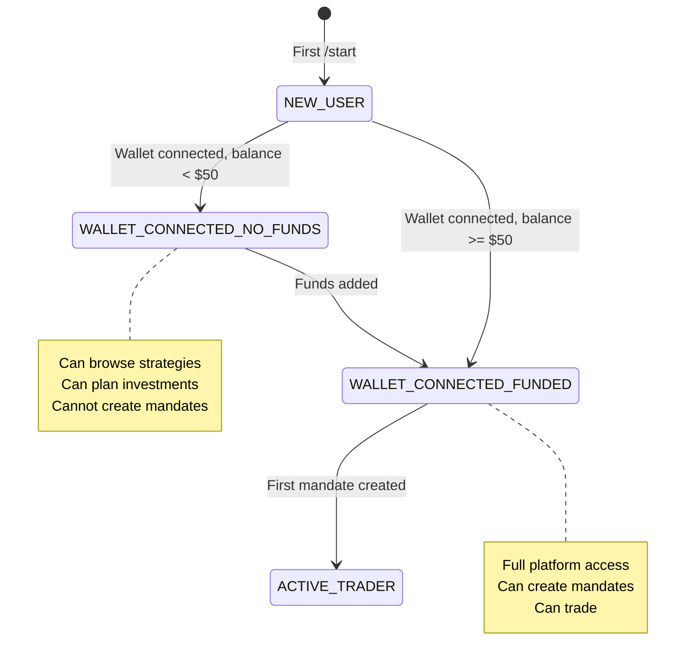
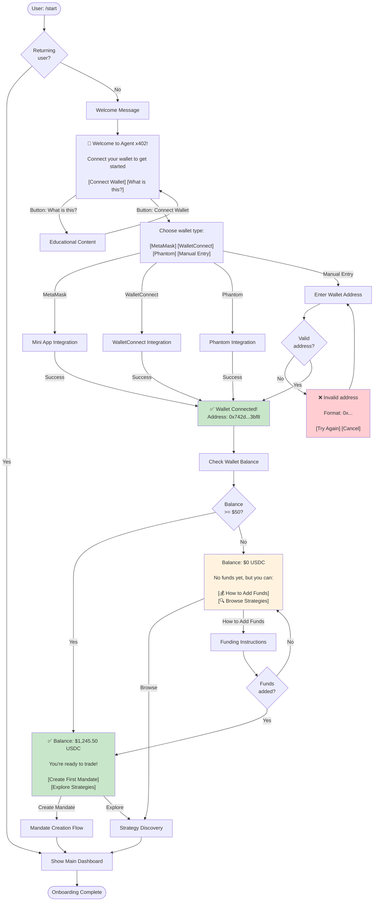
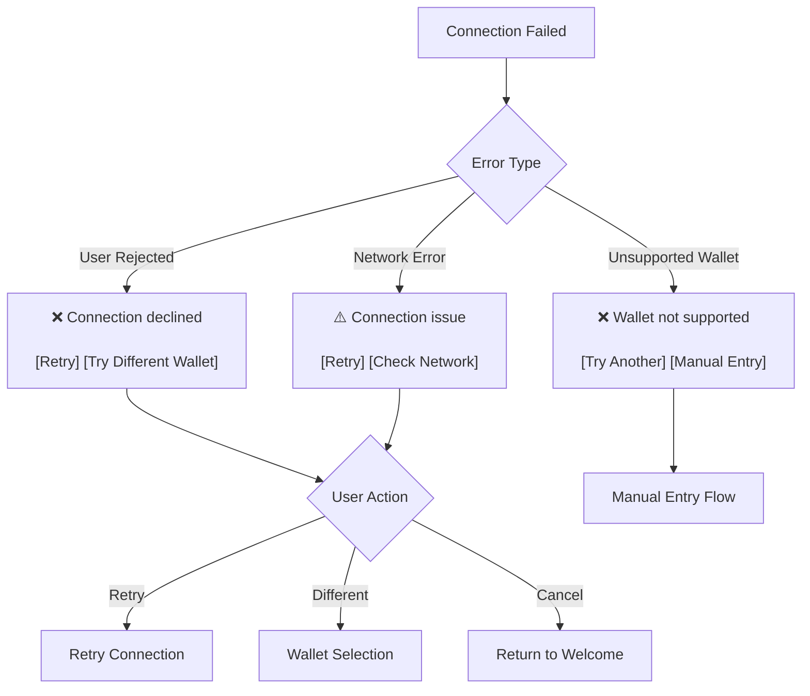

# Onboarding Flow - Agent x402

**Document ID**: PROJECT002
**Created By**: project-manager
**Created At**: 2025-10-03T08:07:54.684Z
**Project Root**: /Users/groot/Documents/code/telegram-402

---

# Onboarding Flow - Agent x402

## Overview

Phase 1 onboarding focuses on direct wallet connection (Option A: User Custody). Users connect their existing wallet, and the bot checks their balance to determine next steps.

---

## User States



---

## Complete Onboarding Flow



---

## Interaction Methods

### Commands
- `/start` - Entry point for new users
- `/wallet` - Access wallet management (during onboarding)
- `/help` - Context-sensitive help

### Natural Language
- "I want to learn first" → Educational content
- "I'll use MetaMask" → MetaMask flow
- "I'll add funds later" → Skip to dashboard

### Buttons
**Step 1 - Welcome:**
- `[Connect Wallet]` - Start connection flow
- `[What is this?]` - Educational overlay

**Step 2 - Wallet Selection:**
- `[MetaMask]` - MetaMask integration
- `[WalletConnect]` - WalletConnect integration
- `[Phantom]` - Phantom integration
- `[Manual Entry]` - Manual address input

**Step 3 - Post-Connection:**
- Funded: `[Create First Mandate]` `[Explore Strategies]`
- Empty: `[How to Add Funds]` `[Browse Strategies]`

---

## Message Templates

### Welcome (New User)
```
Welcome to Agent x402! 🤖

Your AI-powered trading assistant for autonomous crypto strategies.

Let's connect your wallet to get started.

[Connect Wallet] [What is this?]
```

### Wallet Selection
```
Choose your wallet type:

[MetaMask] [WalletConnect]
[Phantom] [Manual Entry]

[← Back]
```

### Manual Address Input
```
Enter your wallet address:

Format: 0x followed by 40 characters

[Cancel]
```

### Wallet Connected - Funded
```
✅ Wallet connected!
Address: 0x742d...3bf8

Balance: 1,245.50 USDC

You're ready to trade!

[Create First Mandate] [Explore Strategies]
```

### Wallet Connected - Empty
```
✅ Wallet connected!
Address: 0x742d...3bf8

Balance: 0 USDC

No funds yet, but you can:
[💰 How to Add Funds] [🔍 Browse Strategies]
```

### Invalid Address Error
```
❌ Invalid wallet address

Please enter a valid Ethereum address:
Format: 0x followed by 40 characters

[Try Again] [Cancel]
```

---

## State Management

### User State Schema
```javascript
{
  userId: "123456789",
  accountState: "WALLET_CONNECTED_FUNDED",
  walletAddress: "0x742d35e9...",
  balance: {
    usdc: 1245.50,
    eth: 0.15
  },
  onboardingComplete: true,
  onboardedAt: "2025-10-03T10:30:00Z"
}
```

### Flow Context (During Onboarding)
```javascript
{
  activeFlow: {
    flowType: "ONBOARDING",
    currentStep: 2,
    stepName: "WALLET_SELECTION",
    startedAt: "2025-10-03T10:30:00Z"
  }
}
```

---

## Error Handling

### Wallet Connection Failed


### Invalid Address Input
- Validate format: `^0x[a-fA-F0-9]{40}$`
- Show error with example
- Allow retry or cancel

### Balance Check Failed
- Retry with exponential backoff
- Fallback: Allow manual balance entry
- Show warning if balance cannot be verified

---

## Success Criteria

### Onboarding Complete When:
1. ✅ Wallet connected successfully
2. ✅ Address validated and saved
3. ✅ Balance checked (or manual confirmation)
4. ✅ User reaches main dashboard

### Metrics to Track:
- Time to wallet connection
- Wallet connection success rate
- Funding conversion rate (empty → funded)
- Onboarding abandonment by step

---

## Phase 1 Simplifications

### Removed Features (for Phase 1):
- ❌ Demo mode / paper trading
- ❌ Testnet mode
- ❌ Email/phone registration
- ❌ Social login options
- ❌ Wallet creation (users must have existing wallet)

### Future Enhancements:
- 🔮 Demo mode for practice
- 🔮 Fiat on-ramp integration
- 🔮 Multi-wallet support
- 🔮 Wallet creation for new users
- 🔮 Social recovery options