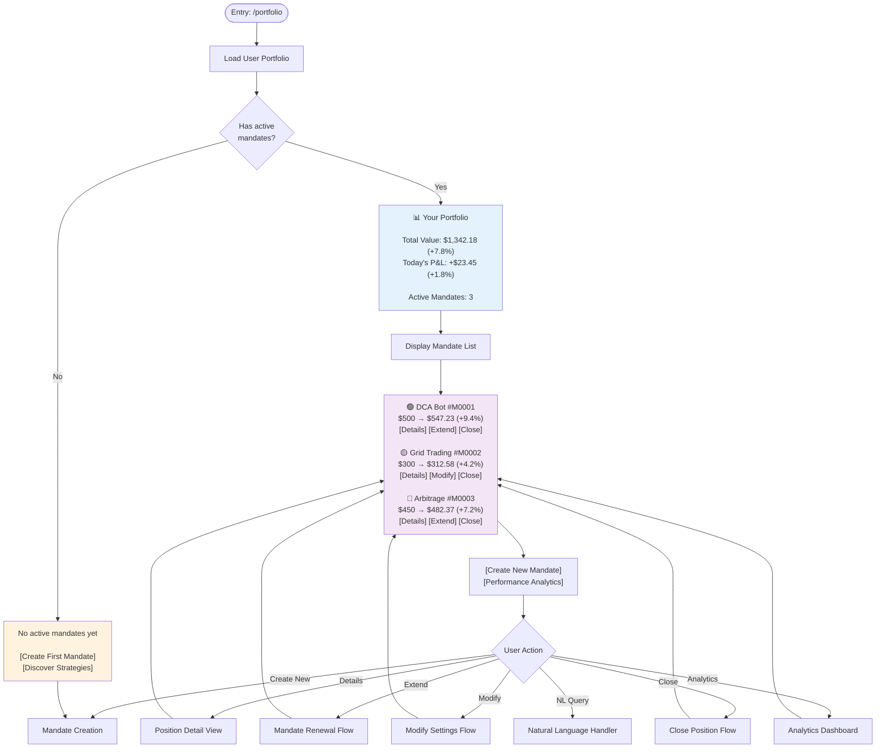
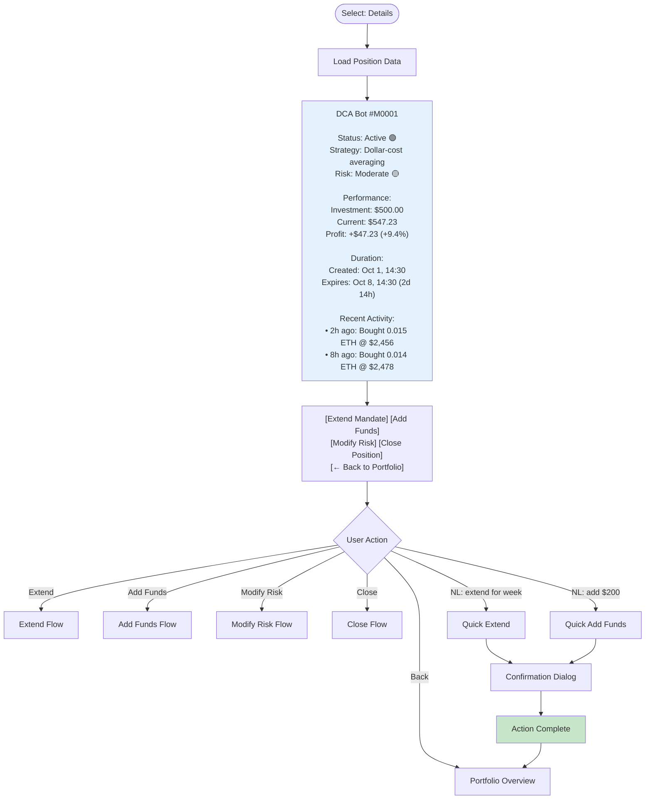
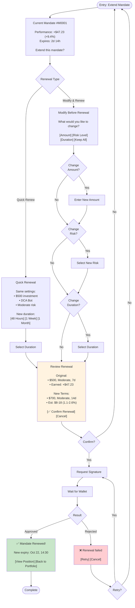
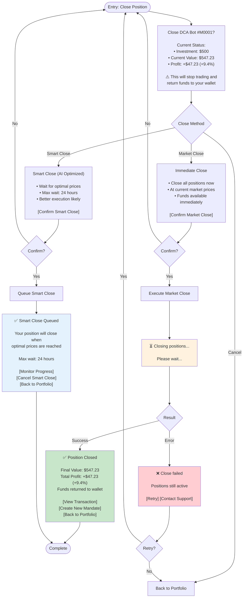
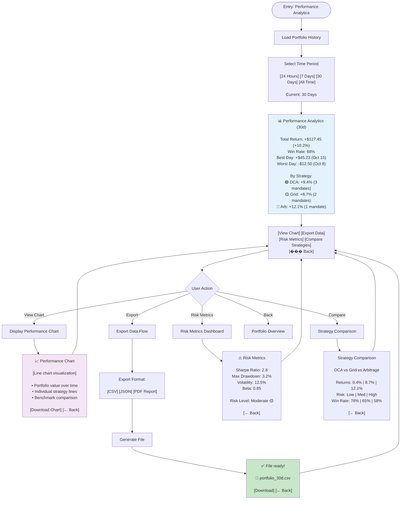
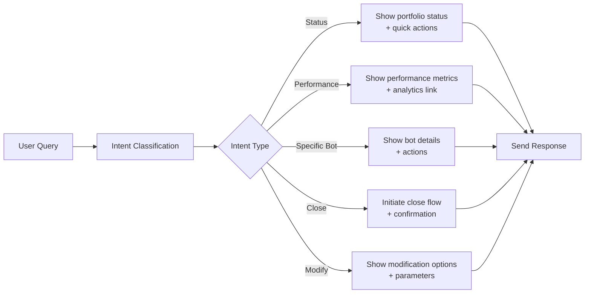
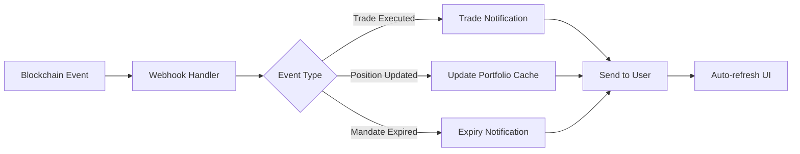

# Portfolio Management Flow - Agent x402

**Document ID**: PROJECT004
**Created By**: project-manager
**Created At**: 2025-10-03T08:10:42.645Z
**Project Root**: /Users/groot/Documents/code/telegram-402

---

# Portfolio Management Flow - Agent x402

## Overview

Portfolio management allows users to monitor active mandates, view performance, manage positions, and execute actions like extending, modifying, or closing mandates.

---

## Portfolio Overview Flow



---

## Position Detail View



---

## Mandate Renewal Flow



---

## Close Position Flow



---

## Performance Analytics



---

## Natural Language Queries

### Portfolio Queries



### Example Queries & Responses

**"How is my portfolio doing?"**
```
📊 Your Portfolio Performance

Total Value: $1,342.18 (+7.8%)
Today: +$23.45 (+1.8%) 🟢

Active Mandates: 3
All performing well!

[View Details] [Performance Analytics]
```

**"Close my DCA position"**
```
You want to close DCA Bot #M0001?

Current Status:
• Investment: $500
• Current Value: $547.23
• Profit: +$47.23 (+9.4%)

[Close Now] [Smart Close] [Cancel]
```

**"How is my arbitrage bot doing?"**
```
Arbitrage #M0003 Status:

• Investment: $450
• Current: $482.37
• Profit: +$32.37 (+7.2%)
• Status: Active 🔴
• Expires: 12 hours

Recent trades:
• 30m ago: +$2.15 (Arb ETH/USDC)
• 2h ago: +$1.87 (Arb BTC/USDC)

[View Full Details] [Extend] [Close]
```

**"Add $200 to Grid Trading"**
```
Add $200 to Grid Trading #M0002?

Current: $300 → $312.58 (+4.2%)
New Total: $500

This will:
• Increase position size
• Require new signature
• Keep same risk/duration

[Confirm] [Change Amount] [Cancel]
```

---

## Entry Methods

### Commands
- `/portfolio` or `/positions` - Main portfolio view
- `/stats` - Quick statistics
- `/close <mandate_id>` - Close specific mandate

### Natural Language
- "Show my portfolio"
- "How are my investments doing?"
- "Close my DCA position"
- "Extend arbitrage for another week"
- "Add $200 to grid trading"

### Buttons
- `[Portfolio]` from main menu
- `[View Position]` from notifications
- `[Back to Portfolio]` from detail views

---

## State Management

### Portfolio State
```javascript
{
  userId: "123456789",
  activeMandates: [
    {
      id: "M0001",
      strategy: "dca",
      amount: 500,
      currentValue: 547.23,
      pnl: 47.23,
      pnlPercent: 9.4,
      status: "ACTIVE",
      expiresAt: "2025-10-08T14:30:00Z"
    }
  ],
  totalValue: 1342.18,
  totalPnl: 127.45,
  totalPnlPercent: 10.2
}
```

### Position Detail State
```javascript
{
  mandateId: "M0001",
  viewType: "DETAIL",
  activeTab: "performance",  // performance | history | settings
  refreshInterval: 30000     // Auto-refresh every 30s
}
```

---

## Auto-Refresh & Real-time Updates

### Refresh Strategy
- **Portfolio Overview**: Refresh every 30 seconds
- **Position Detail**: Refresh every 10 seconds
- **Active Close**: Refresh every 5 seconds
- **Smart Close Queue**: Refresh every 60 seconds

### Real-time Events


---

## Message Templates

### Portfolio Overview
```
📊 Your Portfolio

Total Value: $1,342.18 (+7.8%)
Today: +$23.45 (+1.8%) 🟢

Active Mandates: 3

🟢 DCA Bot #M0001
   $500 → $547.23 (+9.4%)
   Expires: 2d 14h
   [Details] [Extend] [Close]

🟡 Grid Trading #M0002
   $300 → $312.58 (+4.2%)
   Expires: 5d 3h
   [Details] [Modify] [Close]

🔴 Arbitrage #M0003
   $450 → $482.37 (+7.2%)
   Expires: 12h
   [Details] [Extend] [Close]

[Create New Mandate] [Performance Analytics]
```

### Position Detail
```
DCA Bot #M0001

Status: Active 🟢
Strategy: Dollar-cost averaging
Risk: Moderate 🟡

Performance:
Investment: $500.00
Current: $547.23
Profit: +$47.23 (+9.4%)

Duration:
Created: Oct 1, 14:30
Expires: Oct 8, 14:30 (2d 14h)

Recent Activity:
• 2h ago: Bought 0.015 ETH @ $2,456
• 8h ago: Bought 0.014 ETH @ $2,478
• 1d ago: Bought 0.016 ETH @ $2,443

[Extend Mandate] [Add Funds] [Modify Risk]
[Close Position] [← Back to Portfolio]
```

### Empty Portfolio
```
No active mandates yet

Ready to start trading?

[Create First Mandate] [Discover Strategies]
[Learn About Mandates]
```

---

## Success Metrics

### Portfolio Engagement
- Daily portfolio views
- Average time in portfolio view
- Actions per session

### Position Management
- Renewal rate
- Average mandate duration
- Close reasons distribution

### Performance Tracking
- Analytics view rate
- Export frequency
- Chart interaction rate