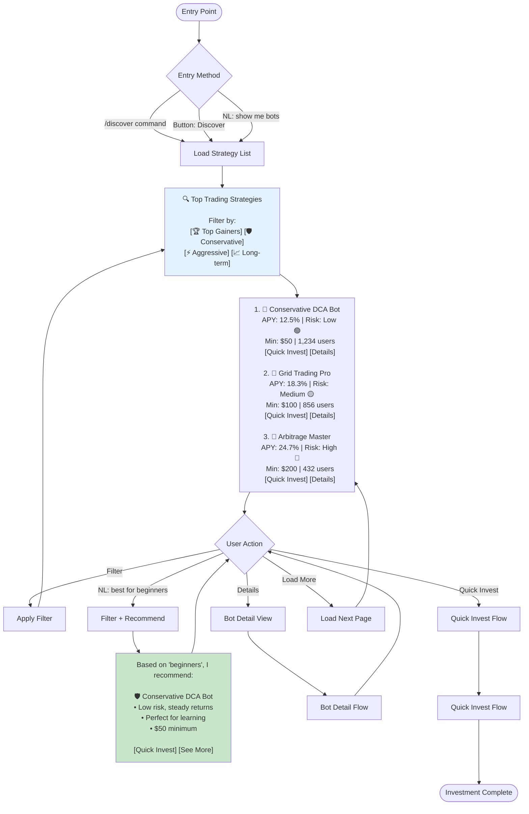
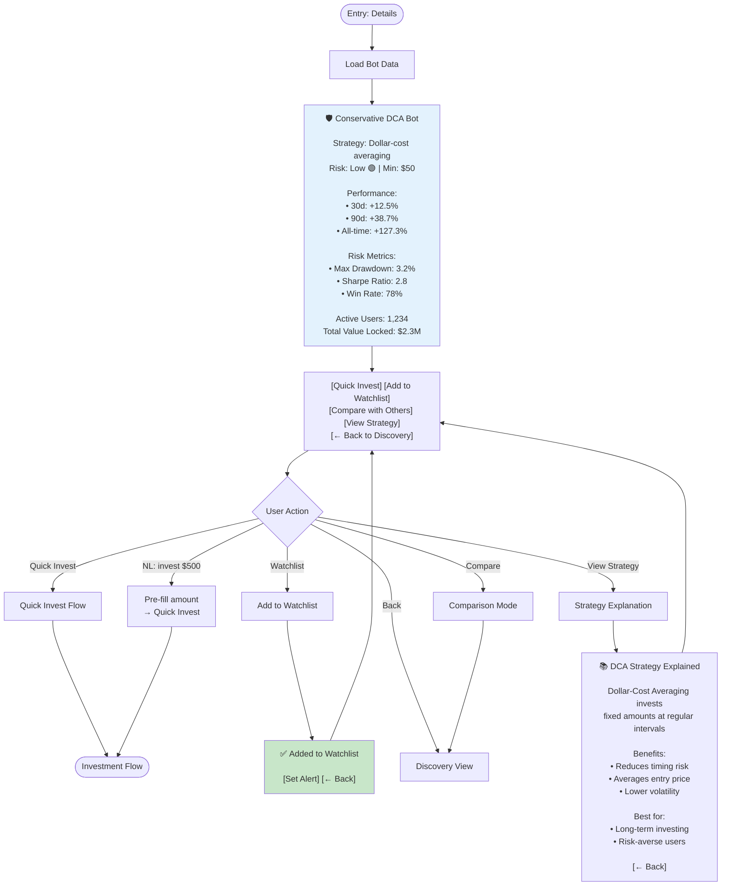
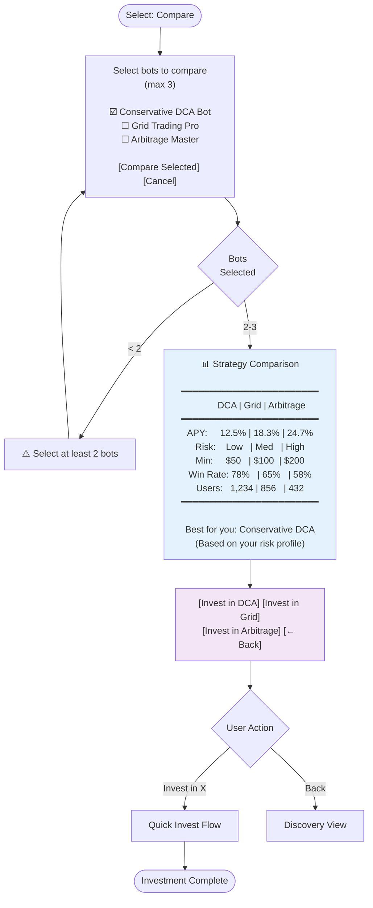
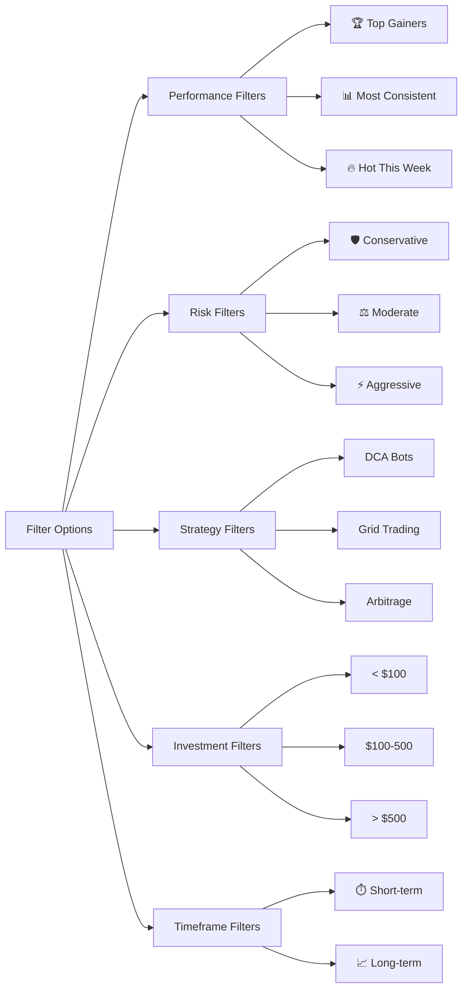
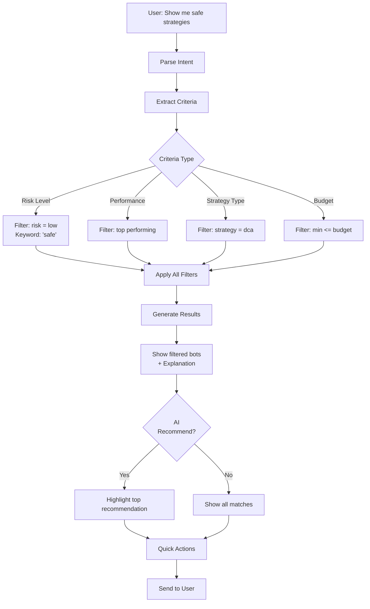
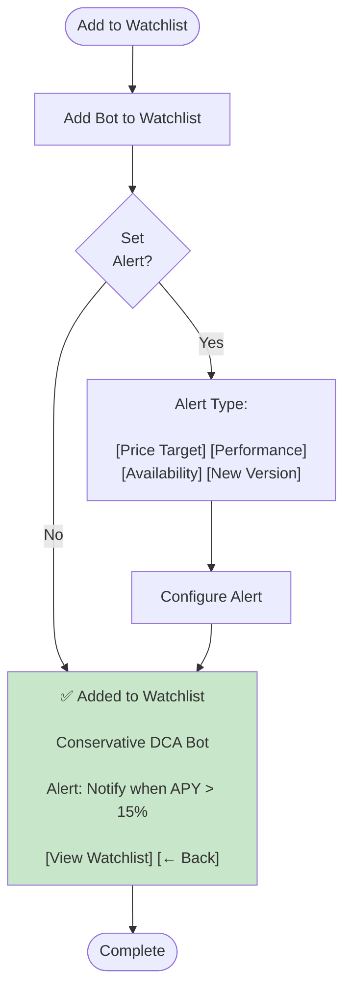

# Bot Discovery & Quick Invest Flow - Agent x402

**Document ID**: PROJECT005
**Created By**: project-manager
**Created At**: 2025-10-03T08:12:11.001Z
**Project Root**: /Users/groot/Documents/code/telegram-402

---

# Bot Discovery & Quick Invest Flow - Agent x402

## Overview

The discovery flow allows users to browse available trading strategies, compare performance, and quickly invest in bots with pre-configured optimal settings.

---

## Discovery Flow



---

## Bot Detail View



---

## Comparison Mode



---

## Quick Invest Flow

```mermaid
flowchart TD
    Start([Entry: Quick Invest]) --> PreConfig["Quick Invest: Conservative DCA Bot<br/><br/>✅ Optimal settings pre-configured!<br/><br/>Amount:<br/>Available: $1,245.50<br/>Recommended: $100-500"]

    PreConfig --> AmountSelect["[$100] [$250] [$500] [Custom]"]

    AmountSelect --> AmountInput{Amount}

    AmountInput -->|Button: $500| ValidAmount1
    AmountInput -->|Custom| CustomAmount[Enter Amount]

    CustomAmount --> ValidAmount1{Valid?}

    ValidAmount1 -->|No| AmountError["❌ Invalid amount<br/><br/>[Try Again]"]
    ValidAmount1 -->|Yes| SaveAmount[Save: amount = $500]

    AmountError --> AmountSelect

    SaveAmount --> DurationSelect["Duration:<br/><br/>[1 Week] [1 Month] [Custom]"]

    DurationSelect --> DurationInput{Duration}

    DurationInput -->|Button: 1 Week| SaveDuration[Save: duration = 7d]
    DurationInput -->|Custom| CustomDuration[Enter Duration]

    CustomDuration --> SaveDuration

    SaveDuration --> RiskConfig["Risk: Moderate 🟡 (Recommended)<br/><br/>Keep recommended or change?<br/><br/>[Keep Moderate] [Change Risk]"]

    RiskConfig --> RiskChoice{Choice}

    RiskChoice -->|Keep| SaveRisk[Save: risk = moderate]
    RiskChoice -->|Change| SelectRisk[Risk Selection]

    SelectRisk --> SaveRisk

    SaveRisk --> QuickReview["Quick Review<br/><br/>Conservative DCA Bot<br/>• Amount: $500<br/>• Duration: 1 week<br/>• Risk: Moderate 🟡<br/><br/>Expected: $5.77-$13.46<br/>Fees: ~$2.50<br/><br/>[✅ Confirm & Sign] [Cancel]"]

    QuickReview --> ReviewAction{Action}

    ReviewAction -->|Confirm| Signature[Signature Request]
    ReviewAction -->|Cancel| Cancel[Return to Discovery]

    Signature --> WaitSign[Wait for Wallet]

    WaitSign --> SignResult{Result}

    SignResult -->|Approved| Success["✅ Investment Successful!<br/><br/>Mandate #M0004 created<br/>Conservative DCA Bot trading<br/><br/>[View Position] [Discover More]"]
    SignResult -->|Rejected| SignError["❌ Signature rejected<br/><br/>[Retry] [Cancel]"]

    SignError --> RetrySign{Retry?}
    RetrySign -->|Yes| Signature
    RetrySign -->|No| Cancel

    Success --> Complete([Complete])

    style PreConfig fill:#e3f2fd
    style QuickReview fill:#fff3e0
    style Success fill:#c8e6c9
    style SignError fill:#ffcdd2
```



---

## Filter System

### Available Filters



### Filter Combinations

**Example 1: Conservative + Top Gainers**
```
🛡️ Conservative Top Gainers

1. Conservative DCA Bot
   APY: 12.5% | Risk: Low 🟢
   [Quick Invest] [Details]

2. Safe Grid Trading
   APY: 10.8% | Risk: Low 🟢
   [Quick Invest] [Details]

[Clear Filters] [Add More Filters]
```

**Example 2: < $100 + Short-term**
```
💰 Affordable Short-term Strategies

1. Quick DCA (48h cycles)
   Min: $50 | APY: 8.5%
   [Quick Invest] [Details]

2. Fast Grid (24h cycles)
   Min: $75 | APY: 11.2%
   [Quick Invest] [Details]

[Clear Filters] [Add More Filters]
```

---

## Natural Language Discovery

### Query Processing



### Example NL Queries

**"Show me the best bot for beginners"**
```
Based on "beginners", I recommend:

🛡️ Conservative DCA Bot

• Perfect for learning
• Low risk, steady returns
• $50 minimum
• 78% win rate

Why this is best for you:
✅ Simple strategy
✅ Proven track record
✅ Low entry barrier
✅ Strong risk management

[Quick Invest $100] [Learn More] [See Others]
```

**"Find me high-return strategies under $200"**
```
High-Return Strategies (< $200):

1. ⚡ Arbitrage Master
   APY: 24.7% | Min: $150
   Risk: High 🔴
   [Quick Invest] [Details]

2. 📈 Aggressive Grid
   APY: 21.3% | Min: $100
   Risk: High 🔴
   [Quick Invest] [Details]

⚠️ Note: Higher returns = higher risk
Consider starting small.

[Invest] [Show Conservative Options]
```

**"What's performing well this week?"**
```
🔥 Hot This Week

1. 🥇 Grid Trading Pro
   7d: +8.2% | APY: 18.3%
   [Quick Invest] [Details]

2. 🥈 DCA Bot Advanced
   7d: +6.7% | APY: 15.1%
   [Quick Invest] [Details]

3. 🥉 Arbitrage Lite
   7d: +9.4% | APY: 22.8%
   [Quick Invest] [Details]

[Invest in Top Pick] [See All Strategies]
```

---

## Watchlist Management

### Add to Watchlist



### View Watchlist

```
⭐ Your Watchlist

1. Conservative DCA Bot
   Current APY: 12.5%
   Alert: When APY > 15%
   [Quick Invest] [Remove]

2. Grid Trading Pro
   Current APY: 18.3%
   Alert: When available < $75
   [Quick Invest] [Remove]

[Set New Alert] [Clear Watchlist]
```

---

## Entry Methods

### Commands
- `/discover` or `/top` or `/bots` - Browse strategies
- `/compare <bot1> <bot2>` - Compare specific bots

### Natural Language
- "Show me top performing bots"
- "What's the best strategy for beginners?"
- "I want to try arbitrage"
- "Find me low-risk options under $100"

### Buttons
- `[Discover Strategies]` from main menu
- `[Quick Invest]` from bot card
- `[Details]` from bot card

---

## Bot Card Information

### Display Format
```
🥇 Conservative DCA Bot
   APY: 12.5% | Risk: Low 🟢
   Min: $50 | 1,234 users
   [Quick Invest] [Details]
```

### Data Shown
- **Rank**: Position in current filter
- **Name**: Bot strategy name
- **APY**: Annualized return percentage
- **Risk Level**: Visual indicator (🟢🟡🔴)
- **Minimum**: Lowest investment amount
- **Users**: Number of active investors
- **Actions**: Quick invest or details buttons

---

## Success Metrics

### Discovery Engagement
- Time spent browsing
- Filter usage patterns
- Details view rate
- Watchlist additions

### Conversion
- Quick Invest usage vs full mandate flow
- Filter-to-invest rate
- Compare-to-invest rate
- NL query success rate

### Bot Performance
- Most viewed bots
- Most invested bots
- Filter popularity
- User preference patterns

---

## Message Templates

### Main Discovery View
```
🔍 Top Trading Strategies

Filter by:
[🏆 Top Gainers] [🛡️ Conservative] [⚡ Aggressive]
[📈 Long-term] [⏱️ Short-term]

---

1. 🥇 Conservative DCA Bot
   APY: 12.5% | Risk: Low 🟢
   Min: $50 | 1,234 users
   [Quick Invest] [Details]

2. 🥈 Grid Trading Pro
   APY: 18.3% | Risk: Medium 🟡
   Min: $100 | 856 users
   [Quick Invest] [Details]

3. 🥉 Arbitrage Master
   APY: 24.7% | Risk: High 🔴
   Min: $200 | 432 users
   [Quick Invest] [Details]

[Load More] [Compare Selected]
```

### Bot Detail
```
🛡️ Conservative DCA Bot

Strategy: Dollar-cost averaging
Risk: Low 🟢 | Min: $50

Performance:
• 30d: +12.5%
• 90d: +38.7%
• All-time: +127.3%

Risk Metrics:
• Max Drawdown: 3.2%
• Sharpe Ratio: 2.8
• Win Rate: 78%

Active Users: 1,234
Total Value Locked: $2.3M

[Quick Invest] [Add to Watchlist]
[Compare with Others] [View Strategy]
[← Back to Discovery]
```

### Quick Invest
```
Quick Invest: Conservative DCA Bot

✅ Optimal settings pre-configured!

Amount:
Available: 1,245.50 USDC
Recommended: $100-500

[$100] [$250] [$500] [Custom]

Duration:
[1 Week] [1 Month] [Custom]

Risk: Moderate 🟡 (Recommended)
[Change Risk Level]

[← Back] [Continue to Review]
```