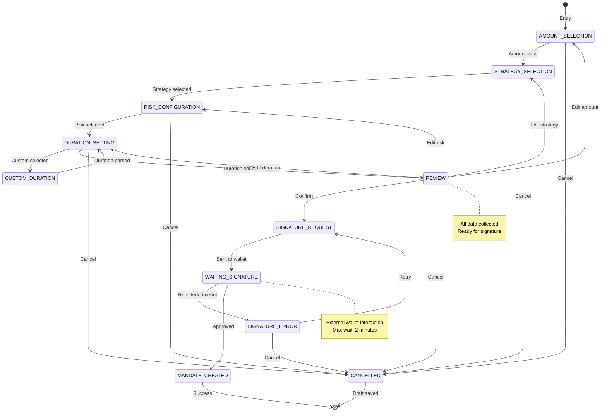
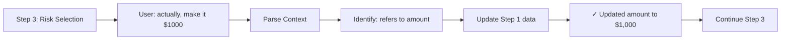
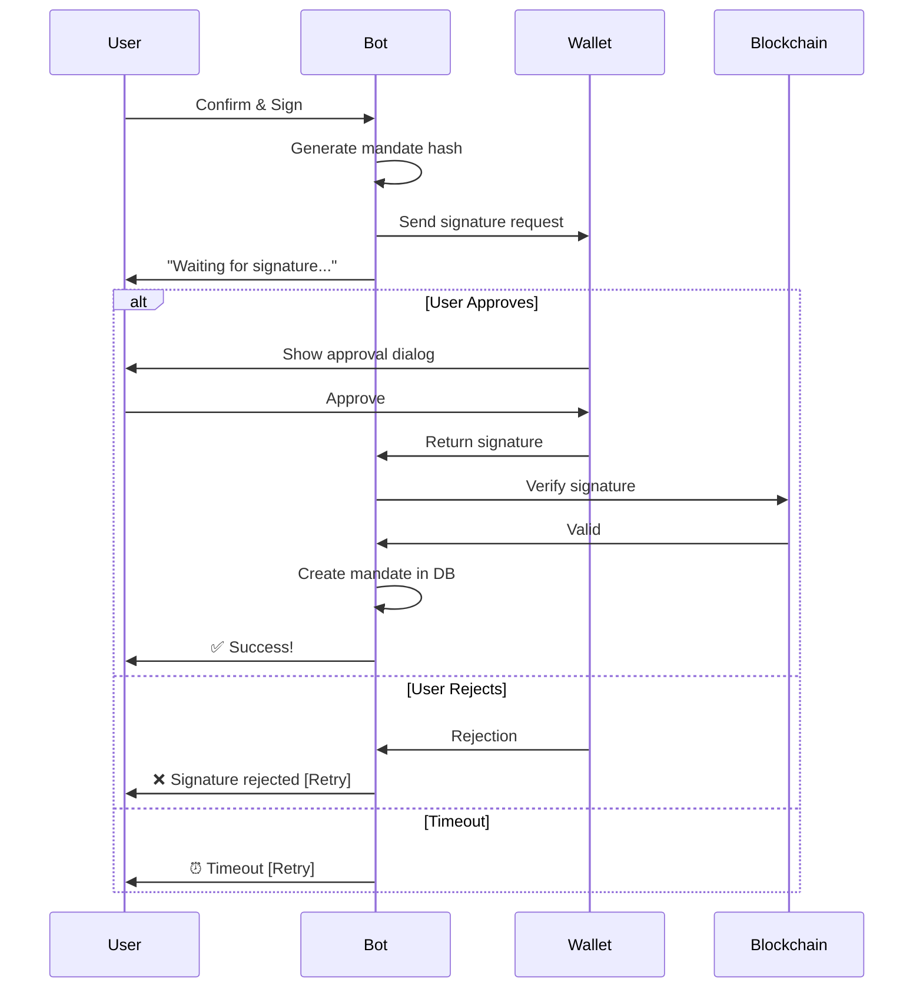

# Mandate Creation Flow - Agent x402

## Overview

The mandate creation flow allows users to set up autonomous trading strategies with defined parameters: amount, strategy type, risk level, and duration. The flow supports both guided step-by-step creation and natural language shortcuts.

---

## Flow Diagram

```mermaid
flowchart TD
    Start([Entry Point]) --> EntryType{Entry Method}

    EntryType -->|/create command| Step1[Step 1: Amount]
    EntryType -->|Button: Create Mandate| Step1
    EntryType -->|NL: invest $500...| ParseNL[Parse Natural Language]
    EntryType -->|Quick Invest from Bot| PreFilled[Pre-filled Parameters]

    ParseNL --> ParseSuccess{Parse<br/>complete?}
    ParseSuccess -->|Full| Step5[Step 5: Review]
    ParseSuccess -->|Partial| ConfirmNL[Confirm Parsed Data]
    ParseSuccess -->|Failed| Step1

    ConfirmNL --> Step5

    PreFilled --> QuickAmount[Amount + Strategy Set]
    QuickAmount --> Step3[Step 3: Risk]

    %% Step 1: Amount Selection
    Step1["Step 1/5: Investment Amount<br/><br/>Available: $1,245.50<br/>Minimum: $50<br/><br/>[$50] [$100] [$250] [$500] [Custom]<br/><br/>[Cancel]"] --> AmountInput{Input Type}

    AmountInput -->|Button $500| ValidateAmount1{Valid?}
    AmountInput -->|Text: 500| ValidateAmount1
    AmountInput -->|NL: all of it| ValidateAmount1
    AmountInput -->|Cancel| CancelFlow[Cancel Dialog]

    ValidateAmount1 -->|< $50| ErrorMin["❌ Minimum is $50<br/><br/>[Try Again]"]
    ValidateAmount1 -->|> Balance| ErrorMax["❌ Insufficient balance<br/><br/>[Try Again]"]
    ValidateAmount1 -->|Valid| SaveAmount[Save: amount = $500]

    ErrorMin --> Step1
    ErrorMax --> Step1
    SaveAmount --> Step2

    %% Step 2: Strategy Selection
    Step2["Step 2/5: Choose Strategy<br/><br/>Investment: $500<br/><br/>[🛡️ DCA Bot] Steady growth, low risk<br/>[⚖️ Grid Trading] Balanced returns<br/>[⚡ Arbitrage] Higher returns, more risk<br/>[🤖 AI Recommended]<br/><br/>[← Back] [Cancel]"] --> StrategyInput{Input Type}

    StrategyInput -->|Button: DCA Bot| SaveStrategy[Save: strategy = dca]
    StrategyInput -->|Text: DCA| SaveStrategy
    StrategyInput -->|NL: the safe one| SaveStrategy
    StrategyInput -->|AI Recommended| AISelect[Show AI Recommendation]
    StrategyInput -->|Back| Step1
    StrategyInput -->|Cancel| CancelFlow

    AISelect --> ConfirmAI{Accept?}
    ConfirmAI -->|Yes| SaveStrategy
    ConfirmAI -->|No| Step2

    SaveStrategy --> Step3

    %% Step 3: Risk Configuration
    Step3["Step 3/5: Risk Level<br/><br/>For DCA Bot with $500:<br/><br/>[🟢 Conservative] 8-10% APY<br/>[🟡 Moderate] 10-14% APY<br/>[🔴 Aggressive] 14-18% APY<br/><br/>Recommended: 🟡 Moderate<br/><br/>[← Back] [Cancel]"] --> RiskInput{Input Type}

    RiskInput -->|Button: Moderate| SaveRisk[Save: risk = moderate]
    RiskInput -->|NL: recommended| SaveRisk
    RiskInput -->|Back| Step2
    RiskInput -->|Cancel| CancelFlow

    SaveRisk --> Step4

    %% Step 4: Duration Setting
    Step4["Step 4/5: Mandate Duration<br/><br/>[48 Hours] [1 Week] [1 Month] [Custom]<br/><br/>After expiry:<br/>• Trading stops automatically<br/>• You can renew anytime<br/><br/>[← Back] [Cancel]"] --> DurationInput{Input Type}

    DurationInput -->|Button: 1 Week| SaveDuration[Save: duration = 7d]
    DurationInput -->|Custom| CustomDuration[Enter Custom Duration]
    DurationInput -->|Text: 2 weeks| ParseDuration[Parse Duration]
    DurationInput -->|Back| Step3
    DurationInput -->|Cancel| CancelFlow

    CustomDuration --> ParseDuration
    ParseDuration --> ValidateDuration{Valid?}
    ValidateDuration -->|< 24h| ErrorDurationMin["❌ Minimum 24 hours<br/><br/>[Try Again]"]
    ValidateDuration -->|> 90d| ErrorDurationMax["❌ Maximum 90 days<br/><br/>[Try Again]"]
    ValidateDuration -->|Valid| SaveDuration

    ErrorDurationMin --> Step4
    ErrorDurationMax --> Step4
    SaveDuration --> Step5

    %% Step 5: Review & Confirmation
    Step5["Step 5/5: Review Mandate<br/><br/>Investment: $500.00 USDC<br/>Strategy: DCA Bot<br/>Risk: Moderate 🟡<br/>Duration: 1 week<br/><br/>Expected: $5.77-$13.46 (1.15%-2.69%)<br/>Fees: ~$2.50 (0.5%)<br/><br/>[Edit Amount] [Edit Strategy]<br/>[Edit Risk] [Edit Duration]<br/><br/>[✅ Confirm & Sign] [Cancel]"] --> ReviewAction{User Action}

    ReviewAction -->|Edit Amount| Step1
    ReviewAction -->|Edit Strategy| Step2
    ReviewAction -->|Edit Risk| Step3
    ReviewAction -->|Edit Duration| Step4
    ReviewAction -->|NL: change duration| UpdateContext[Update Flow Data]
    ReviewAction -->|Confirm & Sign| Step6
    ReviewAction -->|Cancel| CancelFlow

    UpdateContext --> Step5

    %% Step 6: Signature Process
    Step6["⏳ Generating signature request...<br/><br/>Please approve in wallet:<br/><br/>• Amount: 500 USDC<br/>• Strategy: DCA Bot<br/>• Duration: 7 days<br/><br/>Waiting for signature...<br/><br/>[Cancel]"] --> WaitSignature[Send to Wallet]

    WaitSignature --> SignatureResult{Result}

    SignatureResult -->|Approved| Step7
    SignatureResult -->|Rejected| SignError["❌ Signature rejected<br/><br/>[Retry] [Cancel]"]
    SignatureResult -->|Timeout| SignTimeout["⏰ Request timed out<br/><br/>[Retry] [Cancel]"]

    SignError --> RetrySign{Retry?}
    SignTimeout --> RetrySign
    RetrySign -->|Yes| Step6
    RetrySign -->|No| CancelFlow

    %% Step 7: Success
    Step7["✅ Mandate Created!<br/><br/>Mandate ID: #M0001<br/>Status: Active<br/><br/>Your DCA Bot is now trading with $500<br/><br/>[View Live Position]<br/>[Create Another Mandate]<br/>[Return to Portfolio]"] --> Complete([Flow Complete])

    %% Cancel Flow
    CancelFlow["Cancel mandate creation?<br/><br/>Progress will be saved as draft<br/><br/>[Yes, Cancel] [No, Continue]"] --> CancelConfirm{Confirm?}

    CancelConfirm -->|Yes| SaveDraft[Save Draft]
    CancelConfirm -->|No| Resume[Resume Current Step]

    SaveDraft --> Exit([Exit to Menu])

    style Step1 fill:#e3f2fd
    style Step2 fill:#e3f2fd
    style Step3 fill:#e3f2fd
    style Step4 fill:#e3f2fd
    style Step5 fill:#fff3e0
    style Step6 fill:#fff3e0
    style Step7 fill:#c8e6c9
    style ErrorMin fill:#ffcdd2
    style ErrorMax fill:#ffcdd2
    style SignError fill:#ffcdd2
```



---

## State Machine View



---

## Entry Methods

### 1. Command Entry
```bash
/create
/mandate
/create 500          # Pre-fill amount
```

### 2. Natural Language Entry
```bash
"I want to invest $500"
"Create a safe trading strategy"
"Put $200 in a DCA bot for 1 week"
"I want high returns with moderate risk"
```

### 3. Button Entry
- `[Create Mandate]` from main menu
- `[Quick Invest]` from bot detail page

### 4. Quick Invest (Pre-filled)
From bot discovery:
- Strategy already selected
- Optimal settings pre-configured
- User only inputs amount + duration

---

## Natural Language Parsing

### Full Parse Example
```bash
Input: "invest $500 in a safe DCA bot for 1 week"

Parsed:
- amount: 500
- strategy: dca
- risk: conservative (from "safe")
- duration: 7d (from "1 week")

→ Skip to Review (Step 5)
```

### Partial Parse Example
```bash
Input: "I want to invest $500 in something safe"

Parsed:
- amount: 500
- strategy: null
- risk: conservative (from "safe")
- duration: null

→ Show confirmation, then Strategy Selection (Step 2)
```

### Parse Failed Example
```text
Input: "I want to trade"

Parsed:
- amount: null
- strategy: null
- risk: null
- duration: null

→ Start from Amount Selection (Step 1)
```

---

## Contextual Updates

During any step, users can update previous steps via natural language:



**Examples:**
- In Step 3: "actually, make it $1000" → Update amount
- In Step 4: "use aggressive risk" → Update risk
- In Step 5: "change strategy to grid trading" → Update strategy

---

## Draft Management

### Auto-Save
- Save after each step completion
- Preserve on flow interruption
- 24-hour expiration

### Resume Draft
```text
Welcome back!

You have a draft mandate:
• Amount: $500
• Strategy: DCA Bot
• Risk: Not set

[Continue Setup] [Start Over] [Discard]
```

### Draft Schema
```javascript
{
  userId: "123456789",
  flowType: "MANDATE_CREATION",
  data: {
    amount: 500,
    strategy: "dca",
    risk: null,      // Not completed
    duration: null
  },
  savedAt: "2025-10-03T10:30:00Z",
  expiresAt: "2025-10-04T10:30:00Z"
}
```

---

## Validation Rules

### Amount
- ✅ Minimum: $50 USDC
- ✅ Maximum: User's balance
- ✅ Format: Number, with or without $
- ✅ Special: "all" → full balance, "half" → 50% balance

### Strategy
- ✅ Options: DCA, Grid Trading, Arbitrage
- ✅ Aliases: "safe" → DCA, "balanced" → Grid
- ✅ AI can recommend based on profile

### Risk Level
- ✅ Options: Conservative, Moderate, Aggressive
- ✅ Impact on APY and trading behavior
- ✅ Default: Moderate (recommended)

### Duration
- ✅ Minimum: 24 hours
- ✅ Maximum: 90 days
- ✅ Formats: "2 weeks", "48h", "1 month"
- ✅ Presets: 48h, 1 week, 1 month

---

## Signature Process

### Signature Flow


### Mandate Hash Structure
```javascript
{
  user_address: "0x742d...",
  amount: 500000000,  // 500 USDC (6 decimals)
  strategy: "dca",
  risk_level: "moderate",
  duration_seconds: 604800,  // 7 days
  nonce: 1,
  expires_at: 1696867200
}
```

### Signature Verification
1. Reconstruct hash from mandate data
2. Recover signer address from signature
3. Verify signer === user's wallet address
4. Check mandate hasn't expired
5. Store signature with mandate

---

## Error Handling

### Input Validation Errors
```text
❌ Amount must be between $50 and $1,245.50

You entered: $30

Try again or: [$50] [$100] [$250]
```

### Signature Errors
```text
❌ Signature rejected

Didn't receive approval from your wallet.

[Retry] [Change Wallet] [Cancel]
```

### Network Errors
```text
⚠️ Connection issue

Couldn't connect to the network.

[Retry] [Try Again Later]
```

---

## Success Metrics

### Completion Rate
- Track drop-off at each step
- Identify bottlenecks
- Optimize problematic steps

### Time to Complete
- Target: < 2 minutes (guided flow)
- Target: < 30 seconds (NL shortcut)

### Error Rate
- Validation errors per step
- Signature rejection rate
- Network error impact

### Natural Language Effectiveness
- Parse success rate
- Shortcut usage percentage
- Contextual update accuracy

---

## Message Templates

### Step 1: Amount Selection
```sql
Let's create a new trading mandate! 💼

Step 1/5: Investment Amount
How much would you like to invest?

Available: 1,245.50 USDC
Minimum: 50 USDC

[$50] [$100] [$250] [$500] [Custom]

or just type an amount...

[Cancel]
```

### Step 2: Strategy Selection
```text
Step 2/5: Choose Strategy

Investment: $500

[🛡️ DCA Bot]
Steady growth, low risk
APY: 8-12%

[⚖️ Grid Trading]
Balanced returns
APY: 12-18%

[⚡ Arbitrage]
Higher returns, more risk
APY: 18-25%

[🤖 AI Recommended]
Based on your profile

[← Back] [Cancel]
```

### Step 5: Review
```text
Step 5/5: Review Mandate

Investment: $500.00 USDC
Strategy: DCA Bot
Risk Level: Moderate 🟡
Duration: 1 week
Auto-renew: No

Estimated Returns:
• Expected: $5.77 - $13.46 (1.15% - 2.69%)
• Fees: ~$2.50 (0.5%)

⚠️ You will need to sign this mandate with your wallet.

[Edit Amount] [Edit Strategy] [Edit Risk] [Edit Duration]

[✅ Confirm & Sign] [Cancel]
```

### Step 7: Success
```sql
✅ Mandate Created Successfully!

Mandate ID: #M0001
Status: Active

Your DCA Bot is now trading with $500.

What's next?
[View Live Position] [Create Another Mandate]
[Return to Portfolio]
```
